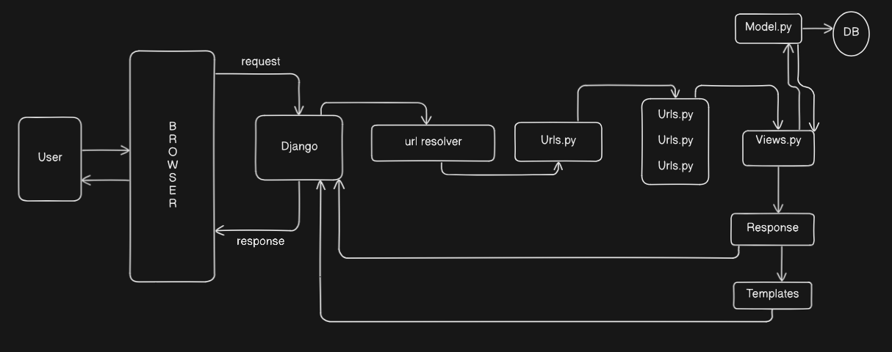

# Django Notes

- **UV** : There is a package maneger which is very fast in process. To install it on Linux: `pip3 install uv`
- **Create virtual enviroment** : It was very easy to create venv in python useing uv. The command is ` uv venv` and to activate the venv by useing this command in Linux: `source .env/bin/activate`
- **Install Django** : To install Django in venv useing uv by useing this command: `uv pip install Django`
- **Create Django Project** : First we need to create a project useing django with help of this command: `django-admin startproject <projectName>`. Here django-admin command is available after Django installation and startproject create the project with help of the projectName(anything given by us). After creating the project there will be a folder with the name as given in projectName and interstingly another folder with the same inside of it. Its a common behaviour of django.
- **Run Django Project** : To run django project first we can go to the project directory and run the manage.py file with runserver. The command is : `python manage.py runserver` . If we want to specify the port we can add it after runserver.
- **How Django works** : When a user interect with django page through browser, first user send a request for a website and then this request is forwarded to Django framework and then the request is send to url resolver and url resolver resolve the user request url and then send the request to its respactive urls.py file where all urls are listed and there is a posibility send that request further respactive urls.py file to get the disire Views.py where all logic and functionaliy is maintained to process the request, if nessecery then interect with database with help of models if not neccessary it execute a response and then send back to django framework to show the result or response to the user and also we use tamplates to send the response to the django framework. The below image illustrate it more

  

- **Create templates** - Creating templates in django is very important to enhence the power of django. For creating it first create a folder named as "templates" and inside it create a html file named as index or anything and then in the views.py we need to import "render" from "django.shortcuts" and then return render with help of request and path of the html file ("index.html") store in "templates" as parameters. And to understand this templates by django we can modify the settings.py, where there is an array of "TEMPLATES" and inside it there is a "DIRS" array and there we need to mention the "templates"(folder name)
  To load css file from static folder first we need to link the stylesheet inside index.html useing template engine by writeing this line of code : `<link rel="stylesheet" href="">` and also load the static with help of template engine into the top of the index.html file. code line is : ``. And then go to settings.py to setup the "STATICFILES_DIRS" as [os.path.join(BASE_DIR, 'static')]. the complete code line is `STATICFILES_DIRS = [os.path.join(BASE_DIR, 'static')]` to work os we need to import os in settings.py

- **Create apps in django** - We can create multiple apps inside a django project on root file. To create an app we write a command on venv as : `python manage.py startapp <name_of_the_app>` , after run this command a folder is created with the name which we give in name of the app and include some default file inside the folder. But in this position the project cannot aware of this newly created app so to connect with the main project we need to go to the settings.py files in root project file and add the new app in the installed app section of the settings.py file. Now if we want to use templates for this newly created app then we need to create a folder name as "templates" and inside it we need to create a folder name as the same as the newly created app name and then inside it we use html file.
- **Connect with new app** - First we need to modify the views.py of the newly created app where we render the html file and the request as a parameter with help of a function. and then in the urls.py file of root project app we need to include newly created app with its urls file like `mibits.urls` and also give the route path. and then in the newly created app urls file add the path.

- **Jinja templates** - We can reuse the same html code into other html file useing some jinja tempates engine command. First we like to create a layout.html file where we can add all html element which are use in each and every project templates. The content or block which are dynamicaly create in app level is to be declared as a unnamed block with a block name and with help of the block name we can dynamically create the element in any app. for example:
  `  Default Title ` in project level templates layout file and to use it in any other app level templates as ` Home `

- **Issue while installing with pip in uv created venv** - Somethime issue is occure in uv created venv when we install some package with pip.So we need to install both uv and pip. To reslove this issue we need to run some command like- Way1: `python -m ensurepip --upgrade` and Way2: `python -m  pip install --upgrade pip`

- **Tailwind in Django** - Tailwind is a great package for developing frontend elements, so to install it on django we need to install a package called django-tailwind by run this command: `uv pip install django-tailwind` and also we need to install reload feature of tailwind to see the changes in frontend by run this command: `uv pip install 'django-tailwind[reload]' `

- **Connect the project with tailwind** - First go to the settings.py file on root folder and then add 'tailwind' in INSTALLED_APPS list. then run a command to start the tailwind like `python manage.py tailwind init` and set the app name to default which is 'theme' and then add 'theme' in INSTALLED_APPS list of setting.py file. and then set the "TAILWIND_APP_NAME" as 'theme' and also set "INTERNAL_IPS" array as ['127.0.0.1] inside the settings.py file. and then istall tailwind by useing the command as: `python manage.py tailwind install `

- **Run tailwind in django** - add this line of code in html file to activate the tailwind, `` and ``. After that use tailwind class and all to access those class. After all these we need to run two terminals, one of them start the tailwind by `python manage.py tailwind start` and in the other one runserver command is execute to run the server. and last we also need to add "NPM_BIN_PATH". For auto reloading reflect we need to add 'django_browser_reload' into 'INSTALLED_APPS' on settings.py, and also add 'django_browser_reload.middleware.BrowserReloadMiddleware' in 'MIDDLEWARE' on settings.py and also we need to add `path("__reload__/", include("django_browser_reload.urls"))` in urls.py file on the root directory.

- **Migration error fix** - When we run a server we have some error like `You have 18 unapplied migration(s).` To solve this error we have many ways. The simple and easy one is just run a command like `python manage.py migrate`.
- **Create superuser for admin panal** - Python provide a precook admin panel in /admin url, its a great feature of django. To use it we need a superuser username and password, To create it simply run a command like ``python manage.py createsuperuser` and then set the username and password and then with help of this credential we can use the admin panel.

- **Change admin panel password** - If we forget our admin password then we can reset the password by running this command : `python manage.py changepassword <user_name> `
- **Models in Django** - We can only create model in the app level not in the project level. To create a model we need to modify on models.py We can decide what database we want to use by changeing the "DATABASE" field in settings.py. To know more on it just go the this page: [Django Databases](https://docs.djangoproject.com/en/5.1/ref/settings/#databases, "DB in django"). If we want to change the db service from like sqlite to postgres then we dont need to change the code just change the "DATABASE" field in settings.py becoz there is ORM layer between code and db which take responsibility to change the connection.

- **Create Models** - To create a model we need add a class into the models.py file. In the class we need model as a parameter and then add all fields which we want to add into the db. If we want to charecter field to add then we use CharField() and so on.
- **Pillow with Django** - To work with medial files we need a package called Pillow to process it to install it just run this command: `python -m pip install Pillow` and then need to modify in settings.py by adding this two line: `MEDIA_URL = '/media/'` and `MEDIA_ROOT = os.path.join(BASE_DIR, 'media')` and then we need to modify the urls.py file by adding some code in "urlpatterns" like this `] + static(settings.MEDIA_URL, document_root=settings.MEDIA_ROOT)`
- **Link models with project** - After creating a model in an app we need to link it with the project or so to say migrate the app to the project by running this command: `python manage.py makemigrations <app_name>` where we need to write actual app name inside the app_name. After runnig this command some files like initial.py are created inside the 'migrations' folder inside the app. And then run this command: `python manage.py migrate`.
- **Superpower of admin panel in django** - Whenever we need to test a model and db connection between them we use a great feature of django called admin page. To do this in action first we need to add a line inside the admin.py file inside of an app like: `admin.site.register(<model_class>)`

- **Transfer data from db to frontend** - To fetch data from the db into views we need to import the model and from that model go to the objects then do operation like all, aggregate, etc for manipulating the data like to fetch all data from db ` names = <model_name>.objects.all()` and then send that data inside the render method. Now we can use this data to show on the page by declareing it in a block on template page.

- **Relationship in models in sql** - There are many relationship between model, some of them are:
  1. One to One : In one to one there is a single connection between two models like a name of developer has one certificate and a certificate has associate with one name of developer. In one to one model need to use method called `OneToOneField()` which requires a model which we want to link with.
  2. One to Many : In one to many connection between two models defines as like a name of developer has many review but a perticular unique review has only associated with a name only. In One to many relation we use `ForeignKey()` to link with the desire model
  3. Many to Many : In many to many connection between two models defines as like in a Devloper community there are many names of developer and a developers names are included in many dev communities. In many to many we use `ManyToManyField()` to linked with desire model.

---

Tips: 1. Its great to use django extenstion to format the django and after install press Ctrl+, and  seach for emmet and find the include language and then add a item with item: django-html and value: html. This helps to geting the suggestion in templates file

